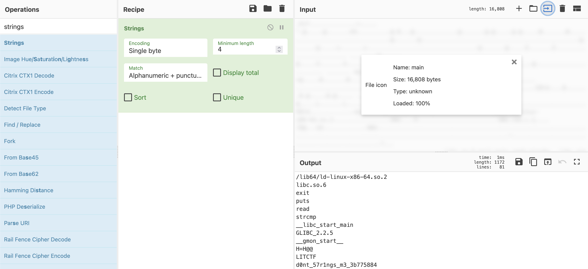

# LIT Newsapp

This was reverse engineering challenge from LIT CTF 2025. The only file provided was named `main`, with no file extension.

Opening the file in a text editor showed mostly unreadable characters.

I used the Strings operation* on [cyberchef.io](cyberchef.io) to extract printable characters, as shown below.

Using Strings was the simplest way to find that the flag was embedded directly in the binary, as seen in the last line in the screenshot above. While more advanced tools like decompilers could also reveal it, they weren't necessary in this case.

---
### Notes
* *The Strings operation on CyberChef is a web tool version of the `strings` command that scans a file and extracts printable characters.

---
_Special thanks to James Young for guidance on this CTF and for helping me learn how to approach it._