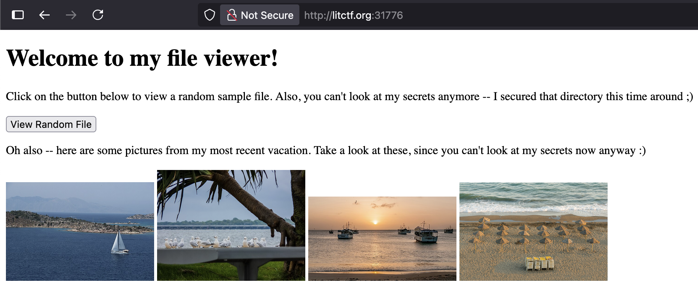

# File Viewer 2

This was a web challenge from LIT CTF 2025. Similar to the first File Viewer, a python file, `app.py` was provided along with a link to a website, [http://litctf.org:31776/](http://litctf.org:31776/), whose home page is shown below.



Unlike the first "file viewer" challenge in this CTF, this one attempts to secure the directory, and this one also includes 4 image files. 

The vulnerability comes from this check in the python code:
```python
if filename[0:2] == '..':
    return abort(400, "Stop trying to look at my secrets >:(")
```

This blocks requests such as `?file=../flag.txt`, since the path starts with `..`.

However, opening one of the website's homepage images in a new tab reveals an image folder. For example: [http://litctf.org:31776/view-file?file=images/sailboat.jpg](http://litctf.org:31776/view-file?file=images/sailboat.jpg).

The flaw is that the server only checks the __first two characters__ of the path. Because `images/` begins with `im` (not `..`), the check passes, even if `../` is used later in the path.

By requesting [http://litctf.org:31776/view-file?file=images/../../flag.txt](http://litctf.org:31776/view-file?file=images/../../flag.txt), we first enter `images/`, and then use `../../` to move up two directories, where `flag.txt` is stored. 

---
_Special thanks to James Young for guidance on this CTF and for helping me learn how to approach it._