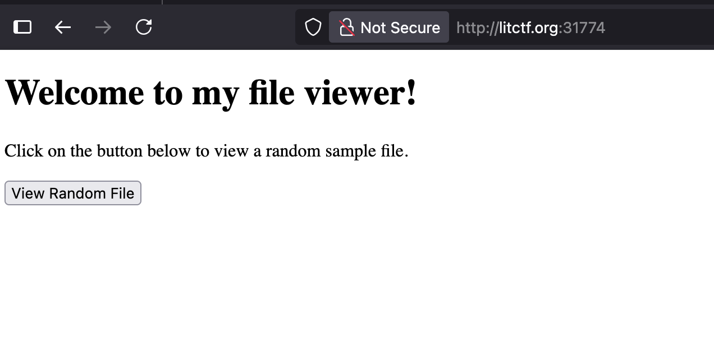

# File Viewer

This was web challenge from LIT CTF 2025. A python file, `app.py` was provided, along with a link to a simple website: [http://litctf.org:31774/](http://litctf.org:31774/), whose home page is shown below.

Clicking the "View Random File" button takes you to one of three sample text files (`sample1.txt`, `sample2.txt`, or `sample3.txt`). The URL follows the format: [http://litctf.org:31774/view-file?file=sample1.txt](http://litctf.org:31774/view-file?file=sample1.txt)

One of the sample files contains the following text: "Have you tried looking outside the directory all of the random files are stored in?"

This hint suggested looking for the flag by navigating the website with file directory navigation commands. The command `../` will take you to the previous directory. Using this, the flag file could be accessed by changing the URL to: [http://litctf.org:31774/view-file?file=../flag.txt](http://litctf.org:31774/view-file?file=../flag.txt).

---
_Special thanks to James Young for guidance on this CTF and for helping me learn how to approach it._